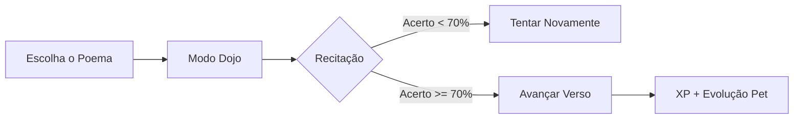

<div align="center">


# 🌌 NEXOMENTE
### ✦ *Seu Segundo Cérebro — Offline, Gamificado e com IA de Elite* ✦

<br>

[](#)
[](#)
[](#)
[](#)

<br>

> *"Onde o **Obsidian** encontra o **Anki** e o **Tamagotchi** em uma interface Sci-Fi premium.*
> *Nenhum byte sai do seu hardware. O domínio do seu conhecimento é total."*

<br>

```
┌───────────────────────────────────────────────────────────────────────┐
│  📝 Notas Wiki   🎙️ Dojo de Voz   📇 Flashcards   🕸️ Grafo   👾 RPG    │
│  ⏱️ Pomodoro    🎓 Questões      📜 Poemas       💾 100% Local (AI)   │
└───────────────────────────────────────────────────────────────────────┘
```

</div>

---

<br>

## ◈ A Nova Era: Dojo de Poesia 🎙️🖋️
O NexoMente agora **ouve você**. Treine sua oratória e memorize obras clássicas com o motor **Whisper AI (STT)** rodando 100% local.

- **Prática Verso a Verso**: Esconda o texto e teste sua memória.
- **Feedback em Tempo Real**: Palavras brilham em **Verde** (acerto) ou **Vermelho** (erro).
- **Trava de Progressão**: Avance apenas com **≥70%** de precisão.
- **Score Animado**: Ganhe XP e suba de nível recitando com maestria.



---

<br>

## ◈ Dashboard "Horizonte Perfeito" 🏙️
Uma interface desenhada para o foco absoluto, com estética **Glassmorphism Sci-Fi**.

- **Simetria de Grid**: Alinhamento preciso entre conteúdo e operação em duas faixas horizontais.
- **Métricas Neon 2x**: Cards com halo radial dinâmico e brilho intenso centrado nos dados.
- **Comandos Rápidos**: Ações inteligentes integradas ao seu fluxo de trabalho.
- **Mascote Evolutivo**: Seu Tamagotchi reage em tempo real a cada sessão de estudo concluída.

---

<br>

## ◈ Funcionalidades Core

<table>
  <tr>
    <td width="50%" valign="top">

### 📝 Wiki-Notes Inteligentes
- Editor **TipTap** premium (Markdown + WYSIWYG)
- Conexões neurais via `[[wikilinks]]` automáticos
- Suporte nativo a fórmulas **LaTeX** (KaTeX)
- Sincronização bidirecional com pasta `.md` local

</td>
    <td width="50%" valign="top">

### 🤖 IA de Bolso (100% Offline)
- **Llama 3.2** rodando no seu hardware (via Ollama/LM Studio)
- Gera **Flashcards** e Questões automaticamente
- Chat contextual que "lê" suas anotações ativas
- **Privacidade absoluta**: Seus dados nunca saem da máquina

</td>
  </tr>
  <tr>
    <td width="50%" valign="top">

### 📇 Flashcards (SM-2)
- Algoritmo **SuperMemo 2** adaptativo ao seu ritmo
- Criação em massa via IA ou Manual
- Botão "Recitei" com feedback visual imediato
- Revisões focadas só no que você está esquecendo

</td>
    <td width="50%" valign="top">

### 🕸️ Grafo de Conexões
- Visualização interativa via **Cytoscape.js**
- Nós coloridos por matéria e relevância
- Preview instantâneo ao pairar sobre os nós
- Filtros dinâmicos por tags e conexões de conhecimento

</td>
  </tr>
</table>

---

<br>

## ◈ O Sistema RPG — Gamificação Profunda 👾
Cada sessão de foco concluída alimenta e evolui o seu companheiro virtual.

**⚡ A Jornada de 30 Níveis:**
- **Nv. 01-05**: 🥚 Ovinho ➔ 🦆 Pato (Início da jornada)
- **Nv. 11-15**: 🦝 Guaxinim ➔ 🦁 Leão (Força acumulada)
- **Nv. 26-30**: 🌌 Ser Cósmico ➔ ✴️ Forma Final (Domínio Total)

**🔥 Multiplicadores de Streak:**
- Estude 7 dias seguidos: **XP x2**
- Estude 30 dias seguidos: **XP x3**

---

<br>

## ◈ Stack Técnica de Elite 🛠️

```
╔═══════════════════════════════════════════════════════════════╗
║                     NEXOMENTE — ARCHITECTURE                 ║
╠══════════════════╦════════════════════════════════════════════╣
║  Runtime         ║  Electron v28 (Frameless / Hi-Fi UI)      ║
║  UI Engine       ║  React 18 + Vite + Framer Motion          ║
║  Intelligence    ║  Transformers.js (Whisper Offline)        ║
║  Local LLM       ║  Llama-3.2 (3B) / Qwen-2.5                ║
║  Database        ║  SQLite WASM (100% Persistente)           ║
║  Editor          ║  TipTap Pro + LaTeX + WikiLinks           ║
╚══════════════════╩════════════════════════════════════════════╝
```

---

<br>

## ◈ Instalação & Setup 🚀

```bash
# 1. Clone o repositório
git clone https://github.com/bruno-felipe-conte/nexomente.git

# 2. Instale dependências
npm install

# 3. Baixe o motor de voz (Whisper)
node scripts/download-model.js

# 4. Inicie o ecossistema
npm run dev
```

---

<br>

## ◈ Privacidade — O Pilar de Aço
```
╔═══════════════════════════════════════════════════════════════╗
║  🔒 O QUE NUNCA SAI DO SEU COMPUTADOR                        ║
╠═══════════════════════════════════════════════════════════════╣
║  ✅  Suas Notas, Flashcards e Segredos                        ║
║  ✅  Suas Gravações de Voz e Transcrições                     ║
║  ✅  Prompts enviados para a IA Local                         ║
╠═══════════════════════════════════════════════════════════════╣
║  ❌  Sem telemetria   ❌  Sem login   ❌  Sem nuvem           ║
╚═══════════════════════════════════════════════════════════════╝
```

<br>

<div align="center">

*Moldado com paixão por **Bruno Felipe Conte**.*

[](#)
[](#)

</div>
