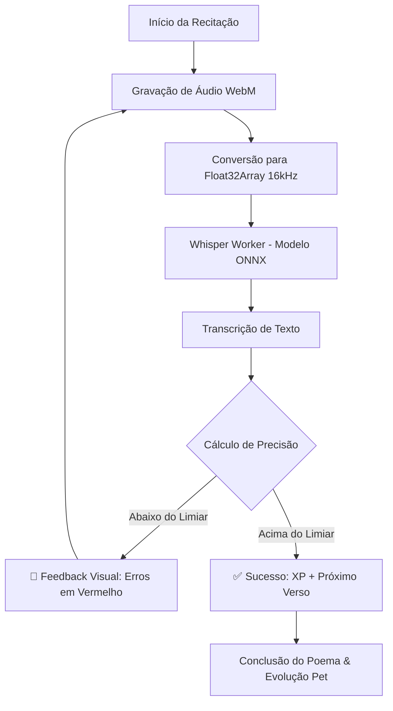

<div align="center">


# 🌌 NEXOMENTE: THE ULTIMATE SECOND BRAIN
### ✦ *Local Intelligence. Gamified Wisdom. Absolute Privacy.* ✦

<br>

[](#)
[](#)
[](#)
[](#)
[](#)

<br>

> **"A simbiose perfeita entre a profundidade do Obsidian, a eficácia do Anki e o vício do Tamagotchi."**  
> *Onde cada byte de conhecimento pertence a você e ninguém mais.*

<br>

</div>

---

## ◈ 📖 O Que é o NexoMente?

O **NexoMente** não é apenas um app de notas; é um ecossistema de **Gestão do Conhecimento Pessoal (PKM)** projetado para quem busca maestria sem comprometer a privacidade. Ele utiliza Inteligência Artificial de última geração rodando localmente (no seu hardware) para transcrever sua voz, gerar flashcards e organizar seus pensamentos em um grafo neural interativo.

---

## ◈ 🎙️ A Joia da Coroa: Dojo de Poesia (Whisper AI)

O Dojo de Recitação é onde a oratória encontra a neurociência. Utilizando o motor **OpenAI Whisper (via Transformers.js)**, o app analisa sua fala verso a verso.

### ⚡ Como funciona o Motor de Voz:
1.  **Captura High-Fidelity**: Áudio processado a 16kHz via `AudioContext`.
2.  **Worker Off-Thread**: A transcrição acontece em um Web Worker dedicado, mantendo a interface a 60 FPS.
3.  **Algoritmo de Match**: Compara tokens normalizados para calcular precisão percentual.
4.  **Gamificação de Voz**: Ganhe XP proporcional à sua acurácia e memorize obras clássicas para sempre.



---

## ◈ 🎮 Sistema Tamagotchi: Estude ou o Pet Sofre

O NexoMente transforma seu esforço intelectual em evolução biológica virtual. Seu companheiro reage à sua produtividade.

### 🧬 Ciclo de Evolução (30 Níveis)
| Nível | Estágio | Visual | Requisito de Foco |
| :--- | :--- | :---: | :--- |
| **01 - 05** | Recém-Nascido | 🥚 ➔ 🐣 | 5h de Estudo Total |
| **06 - 15** | Aprendiz Ativo | 🐥 ➔ 🦊 | 25h + 100 Flashcards |
| **16 - 25** | Guardião do Saber | 🐺 ➔ 🦁 | 100h + 500 Flashcards |
| **26 - 30** | Entidade Cósmica | 🦅 ➔ ✴️ | Domínio Total das Matérias |

**⚠️ Mecânica de Sobrevivência**: Se você não estudar por mais de 48 horas, seu pet começa a perder HP. A única cura é uma sessão de foco ou revisão de cards.

---

## ◈ 🧠 Inteligência Artificial 100% Local (LLM)

Esqueça assinaturas de IA e preocupações com dados na nuvem. O NexoMente integra-se ao seu motor local para:

- **Geração Automática de Flashcards**: Selecione um parágrafo e peça para a IA criar perguntas SM-2.
- **Chat Contextual**: A IA "lê" a nota que você está editando e ajuda a expandir conceitos.
- **Resumos Inteligentes**: Transforme capítulos extensos em bullet points acionáveis.
- **Suporte a Modelos**: Otimizado para **Llama 3.2 (3B)** e **Qwen 2.5 (7B)**.

---

## ◈ 🕸️ Grafo de Conhecimento Neuronal

Visualize como suas ideias se conectam. Cada link `[[wikilink]]` cria um caminho no seu cérebro digital.

- **Física de Partículas**: Nós que "puxam" e "empurram" conforme a relação semântica.
- **Cores por Categoria**: Identifique áreas de domínio (ex: Direito em Vermelho, Medicina em Verde).
- **Preview Hover**: Veja o conteúdo de uma nota sem sair da visão de Grafo.

---

## ◈ 🛠️ Stack Técnica & Arquitetura

O NexoMente é construído sobre uma base tecnológica robusta e moderna:

- **Core**: React 18 & Vite (Frontend ultra-veloz)
- **Runtime**: Electron 28 (Desktop nativo com acesso ao sistema de arquivos)
- **Estética**: CSS Vanilla com Tokens de Design (Glassmorphism & Sci-Fi)
- **Voz**: Transformers.js (Whisper ONNX Quantized)
- **Persistência**: SQLite WASM + LocalStorage (Backup automático em Markdown)
- **Animações**: Framer Motion & GSAP

---

## ◈ 🚀 Setup Rápido (Developer Mode)

### Pré-requisitos
- Node.js 18+
- Git

### Instalação
```bash
# 1. Obtenha o código
git clone https://github.com/bruno-felipe-conte/nexomente.git

# 2. Instale as engrenagens
npm install

# 3. Prepare o motor de voz (Execute apenas uma vez)
# Isso baixará o modelo whisper-small para assets/models
node scripts/download-model.js

# 4. Decole!
npm run dev
```

---

## ◈ 🔒 O Manifesto da Privacidade

No NexoMente, a privacidade não é uma opção, é a arquitetura.

- **Zero Cloud**: Não existe servidor central.
- **Zero Telemetria**: Não rastreamos seus cliques.
- **Seus Arquivos, Suas Regras**: Todas as notas são salvas em `.md` legível na sua pasta de usuário. Se você quiser parar de usar o app amanhã, suas notas continuam lá, prontas para qualquer outro editor.

---

<div align="center">

### *“The mind is for having ideas, not holding them.”*  
**Deixe o NexoMente segurar, organizar e evoluir o seu conhecimento.**

<br>

*Orgulhosamente desenvolvido por [Bruno Felipe Conte](https://github.com/bruno-felipe-conte)*

[](https://github.com/bruno-felipe-conte)
[](https://github.com/bruno-felipe-conte/nexomente)

</div>
