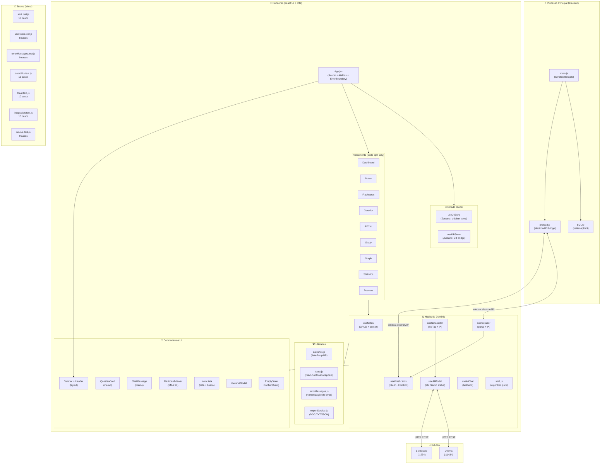
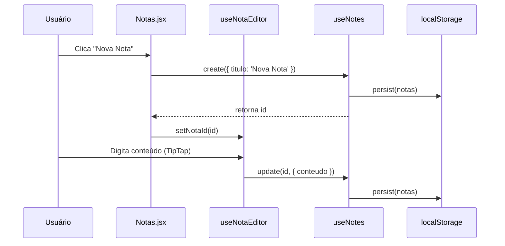
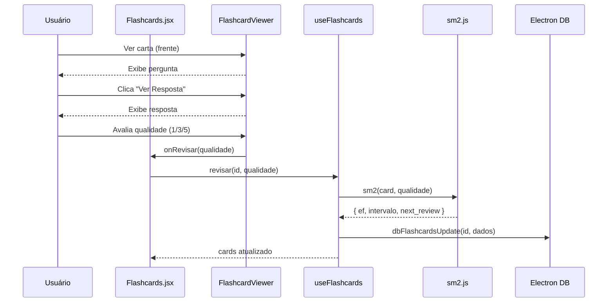

# Arquitetura do NexoMente

> Diagrama gerado em Abril 2026 — representa a estrutura pós-refatoração da Sprint de Profissionalização.

## Visão Geral em Camadas



## Fluxo de Dados — Criação de Nota



## Fluxo SM-2 — Revisão de Flashcard



## Estrutura de Diretórios

```
nexomente/
├── app/
│   └── src/
│       ├── components/
│       │   ├── ai/          # ChatMessage (memo)
│       │   ├── editor/      # BibliotecaPanel, NotaLista
│       │   ├── flashcards/  # FlashcardViewer
│       │   ├── gamification/
│       │   ├── gerador/     # GerarIAModal, QuestaoCard (memo)
│       │   ├── layout/      # Sidebar, Header
│       │   └── ui/          # EmptyState, ConfirmDialog
│       ├── constants/
│       │   └── errorMessages.js
│       ├── hooks/
│       │   ├── sm2.js           # Algoritmo puro SM-2
│       │   ├── useAIModel.js
│       │   ├── useFlashcards.js
│       │   ├── useGerador.js
│       │   ├── useNotes.js
│       │   ├── useNotaEditor.js # Extraído de Notas.jsx
│       │   └── ...
│       ├── lib/
│       │   ├── ai/          # lmStudioService, ollamaService
│       │   ├── editor/      # WikiLink (TipTap extension)
│       │   ├── parser.js    # Parsing de provas
│       │   └── sync/        # syncService (Obsidian)
│       ├── pages/           # 10 páginas (lazy-loaded)
│       ├── services/
│       │   └── exportService.js
│       ├── store/
│       │   ├── useDBStore.js    # Zustand + Electron bridge
│       │   └── useUIStore.jsx   # Zustand: sidebar, tema
│       ├── test/
│       │   ├── setup.js
│       │   ├── smoke.test.js
│       │   ├── sm2.test.js
│       │   ├── useNotes.test.js
│       │   ├── errorMessages.test.js
│       │   ├── dateUtils.test.js
│       │   ├── toast.test.js
│       │   └── integration.test.js
│       └── utils/
│           ├── dateUtils.js     # date-fns ptBR
│           └── toast.js         # Wrappers react-hot-toast
├── .github/
│   ├── workflows/ci.yml
│   └── dependabot.yml
├── CHANGELOG.md
└── vitest.config.js
```

## Decisões Arquiteturais

| Decisão | Escolha | Motivo |
|---|---|---|
| Runtime | Electron v28 | Offline-first, SQLite nativo, sem servidor |
| UI | React 18 + Vite | HMR rápido, code-splitting nativo |
| Estado global | Zustand | Minimal, sem boilerplate |
| Banco | SQLite (better-sqlite3) | Zero config, queries síncronas |
| IA | LM Studio / Ollama | Privacidade total, sem API key |
| Testes | Vitest + jsdom | Compatível com Vite, zero config |
| Revisão espaçada | SM-2 (SuperMemo 2) | Algoritmo clássico, implementado localmente |
| Estilos | Tailwind CSS | Utility-first, sem CSS custom complexo |
| Editor | TipTap 2 | Extensível, suporte Markdown + wiki links |
