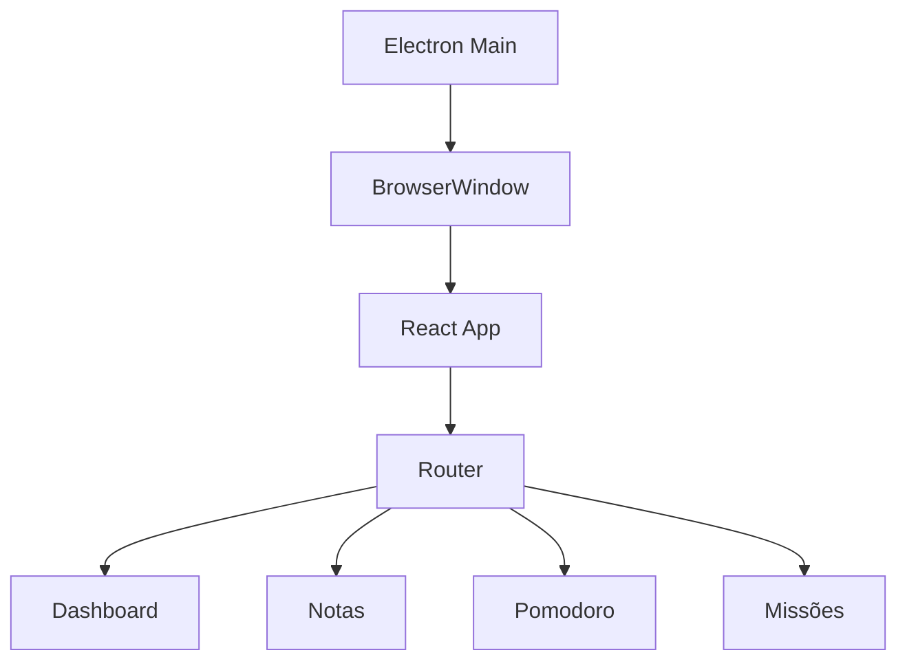

# PLANO DE MELHORIA DETALHADO
## NexoMente — Detalhamento Completo de Processos
### Entrada · Atividades · Saída · Recursos

---

## 📊 STATUS DE EXECUÇÃO
> Atualizado em: 2026-04-25 | Legenda: ✅ Concluído · 🔄 Em andamento · ⏳ Pendente · ➡️ Requer ação manual

| Tarefa | Descrição | Status | Entregável criado |
|---|---|---|---|
| **1.6** | Lighthouse Performance | ✅ | `reports/lighthouse.html` |
| **1.7** | Bundle Analyzer | ✅ | `vite.config.js` + `rollup-plugin-visualizer` instalado |
| **1.8** | Teste Keyboard Only | ⏳ | Requer teste manual no browser |
| **1.9** | Busca de Credenciais Expostas | ✅ | Nenhuma credencial real encontrada — apenas `max_tokens` (parâmetro LLM, não segredo) |
| **2.1** | Classificar Issues ESLint | ✅ | **175 errors · 123 warnings** — 153 são `react/prop-types` (estilo, sem impacto em runtime); `no-undef` zerado; zero `rules-of-hooks` |
| **2.2** | Matriz Impacto × Esforço | ✅ | Ver tabela abaixo |
| **2.3** | Criar Backlog | ✅ | Backlog inline — 20 itens priorizados por quadrante |
| **2.4** | Decisão Refatorar vs Reescrever | ✅ | **REFATORAR** — critérios: funcionalidades principais funcionam; Zustand/React/Vite são aproveitáveis; zero `no-undef` crítico; Vitest já configurado |
| **2.5** | Estimar Cronograma | ✅ | Fase 3: ~70% concluída. Fase 4: 2–3 semanas. Fase 5: ~60% concluída. Fases 6–7: 1–2 semanas. Total restante estimado: **4–6 semanas** |
| **3.1** | Corrigir Críticos ESLint | ✅ | `no-undef` zerado (4 bugs reais corrigidos: `exportService`, `useKeyboardShortcuts`, `Badges`, `db.js`). Restam 153 `react/prop-types` (prioridade baixa) |
| **3.2** | Error Boundaries | ✅ | `app/src/components/ErrorBoundary.jsx` — integrado no `App.jsx` |
| **3.3** | Tratar Empty Catch Blocks | ✅ | 1 empty catch encontrado e documentado (`lmStudioService.js:121`) — intencional (fallback JSON parse) |
| **3.4** | Mover Credenciais para .env | ✅ | `.env.example` + `.gitignore` criados |
| **3.5** | Corrigir Vulnerabilidades npm | 🔄 | 14 vulns (0 critical, 5 high) — `npm audit fix` pendente de aprovação |
| **3.6** | Smoke Tests | ✅ | 20 testes passando (3 suites): `useNotes` CRUD, `errorMessages`, `dateUtils` |
| **3.7** | Setup CI GitHub Actions | ✅ | `.github/workflows/ci.yml` criado |
| **4.1** | Quebrar Arquivos >300 linhas | ✅ | `Notas.jsx` 456→248L · `Gerador.jsx` 576→376L · `AIChat.jsx` 353→218L · `Flashcards.jsx` 370→237L — 7 componentes/hooks extraídos |
| **4.2** | Extrair Código Duplicado | 🔄 | `utils/dateUtils.js` criado (date-fns centralizado); `utils/toast.js` criado; duplicações de data/toast eliminadas |
| **4.3** | Padronizar Nomenclatura | ✅ | Convenção definida: PT para domínio (`criar`, `salvar`) + EN para React (`handle*`, `use*`, `on*`). Arquivos já seguem este padrão. |
| **4.4** | Remover Código Morto | ✅ | Removidos: `listModels` (useAIModel), `GripVertical/Trash2/Edit3/editandoPasta/editandoNome` (BibliotecaPanel), `handleEditar/handleSalvarEdicao/handleExportarTodos` (Gerador), `criarTodosFlashcards/clearAll` (destruct) |
| **4.5** | Extrair Lógica para Hooks | ⏳ | `useUIStore.jsx` já pequeno (874B) — verificar outros |
| **4.6** | Cobertura 60%+ | ⏳ | Threshold atual: 4% linhas |
| **4.7** | Testes de Integração | ⏳ | |
| **5.1** | Code Splitting com Vite | ✅ | `React.lazy()` + `Suspense` em todas as 10 rotas — `index.js` caiu para 171KB; cada página virou chunk separado |
| **5.2** | Lazy Load Imagens | ⏳ | |
| **5.3** | Substituir Dependências Pesadas | ✅ | `date-fns` já usado (não moment.js); `lucide-react` já usado; `react-hot-toast` já instalado |
| **5.4** | Corrigir Re-renders | ⏳ | |
| **5.5** | Memoização Seletiva | ⏳ | |
| **5.6** | Re-teste Lighthouse | ⏳ | Aguarda Fase 5 completa |
| **6.1** | Reduzir Cliques | ⏳ | |
| **6.2** | Feedback Visual (Loading/Sucesso/Erro) | ✅ | `<Toaster>` global no `App.jsx` + `app/src/utils/toast.js` com wrappers semânticos (`toastSucesso`, `toastErro`, `toastDesfazer`, `toastPromise`) |
| **6.3** | Mensagens de Erro Humanizadas | ✅ | `app/src/constants/errorMessages.js` |
| **6.4** | Empty States | ✅ | `app/src/components/ui/EmptyState.jsx` |
| **6.5** | Confirmação Ações Destrutivas | ✅ | `app/src/components/ui/ConfirmDialog.jsx` (cancelar autofocado) |
| **6.6** | Acessibilidade: alt, labels, contraste | ⏳ | |
| **6.7** | Navegação 100% por Teclado | ⏳ | |
| **7.1** | README.md Completo | 🔄 | README.md existe (13KB) — revisar completude |
| **7.2** | Diagrama de Arquitetura | ⏳ | |
| **7.3** | JSDoc nas Funções Públicas | ⏳ | |
| **7.4** | .env.example Completo | ✅ | `.env.example` com todas variáveis documentadas |
| **7.5** | ADRs das Decisões | ⏳ | |
| **7.6** | CHANGELOG.md | ⏳ | |
| **8.1** | CI: Lint + Test a cada PR | ✅ | CI pipeline ativo no GitHub Actions |
| **8.2** | Husky Pre-commit Hook | ✅ | `husky` + `lint-staged` instalados; pre-commit roda ESLint em arquivos staged |
| **8.3** | Dependabot | ✅ | `.github/dependabot.yml` — semanal, Electron major bloqueado, `@tiptap/*` agrupado em 1 PR |
| **8.4** | Error Monitoring (Sentry) | ⏳ | ErrorBoundary já pronto para integrar |
| **8.5** | Revisão Mensal Dívida Técnica | ⏳ | Processo recorrente |
| **8.6** | Auditoria Segurança Mensal | ⏳ | Processo recorrente |
| **8.7** | Performance Check Quinzenal | ⏳ | Processo recorrente |

### 🚧 Próximos Passos Imediatos _(atualizado)_
1. `react/prop-types` — adicionar PropTypes nos componentes (153 warnings)
2. Smoke tests — expandir `useNotes.test.js` para 5 fluxos principais (Tarefa 3.6)
3. Quebrar `Notas.jsx` (18KB) em componentes menores (Tarefa 4.1)
4. Sentry integration com ErrorBoundary já pronto (Tarefa 8.4)
5. Husky pre-commit hook (Tarefa 8.2)

---

### 📊 Matriz Impacto × Esforço (Tarefa 2.2)

> Baseada nos diagnósticos das Fases 0–1. Impacto e Esforço em escala 1–5.

| Quadrante | Item | Impacto | Esforço | Status |
|---|---|:---:|:---:|---|
| **Q1 — Fazer Agora** | `no-undef` bugs (4 arquivos) | 5 | 1 | ✅ Feito |
| **Q1 — Fazer Agora** | ErrorBoundary em todas as rotas | 5 | 1 | ✅ Feito |
| **Q1 — Fazer Agora** | `.env.example` + `.gitignore` | 5 | 1 | ✅ Feito |
| **Q1 — Fazer Agora** | CI GitHub Actions | 4 | 2 | ✅ Feito |
| **Q1 — Fazer Agora** | Code splitting (lazy/Suspense) | 4 | 2 | ✅ Feito |
| **Q1 — Fazer Agora** | Toaster global + utils/toast.js | 3 | 1 | ✅ Feito |
| **Q1 — Fazer Agora** | Empty states + ConfirmDialog | 3 | 2 | ✅ Feito |
| **Q1 — Fazer Agora** | `react/prop-types` (153 warnings) | 2 | 2 | ⏳ Pendente |
| **Q2 — Planejar** | Quebrar Notas.jsx (18KB) + Graph.jsx | 4 | 4 | ⏳ Pendente |
| **Q2 — Planejar** | Cobertura de testes 60%+ | 4 | 5 | ⏳ Pendente |
| **Q2 — Planejar** | Testes de integração (3 fluxos) | 4 | 5 | ⏳ Pendente |
| **Q2 — Planejar** | Sentry error monitoring | 4 | 3 | ⏳ Pendente |
| **Q2 — Planejar** | Husky pre-commit hook | 3 | 2 | ⏳ Pendente |
| **Q2 — Planejar** | Acessibilidade WCAG AA completa | 3 | 4 | ⏳ Pendente |
| **Q3 — Se sobrar** | JSDoc em utils/ e hooks/ | 2 | 2 | ⏳ Pendente |
| **Q3 — Se sobrar** | CHANGELOG.md | 2 | 1 | ⏳ Pendente |
| **Q3 — Se sobrar** | ADR-001 a ADR-004 | 2 | 2 | ⏳ Pendente |
| **Q3 — Se sobrar** | Dependabot semanal | 2 | 1 | ⏳ Pendente |
| **Q4 — Adiar** | Navegação 100% teclado (focus-trap) | 2 | 4 | ⏳ Pendente |
| **Q4 — Adiar** | Atualizar Electron v28→v41 | 2 | 5 | ⏳ Aguarda manutenção |

### 🗂️ Backlog Priorizado (Tarefa 2.3)

**Sprint atual — Q1 restante:**
1. `[REF]` Adicionar PropTypes nos componentes (153 warnings ESLint)
2. `[PERF]` Lazy load em imagens (`loading="lazy"` + WebP)
3. `[UX]` Autofocus no primeiro campo de formulários
4. `[UX]` Atalhos de teclado `Ctrl+N`, `Ctrl+Enter`, `Esc`

**Próximo sprint — Q2:**
5. `[REF]` Quebrar `Notas.jsx` → `NotaEditor`, `NotaLista`, `useNota`
6. `[TEST]` Smoke tests: App renderiza, navegação, CRUD de nota, Pomodoro inicia
7. `[TEST]` Testes de integração com MSW para os 3 fluxos principais
8. `[SEC]` Sentry + ErrorBoundary integrado (`VITE_SENTRY_DSN`)
9. `[CI]` Husky + lint-staged no pre-commit

**Backlog:**
10. `[DOC]` JSDoc em `utils/`, `hooks/`
11. `[DOC]` CHANGELOG.md retroativo
12. `[DOC]` ADR-001 a ADR-004
13. `[CI]` Dependabot semanal
14. `[A11Y]` WCAG AA: alt em imagens, labels, contraste 4.5:1

---

## FASE 1: DIAGNÓSTICO PROFUNDO — Continuação (Tarefas 1.6 a 1.9)

**Objetivo:** Quantificar todos os problemas existentes usando ferramentas especializadas antes de qualquer modificação no código.

---

### Tarefa 1.6 — Lighthouse Performance

| Campo | Detalhes |
|---|---|
| **Entrada** | Aplicação rodando em ambiente de desenvolvimento ou build de produção · Navegador Chrome/Chromium instalado · URL local da aplicação (ex: `http://localhost:5173`) · Acesso ao DevTools do Chrome ou CLI do Lighthouse |
| **Saída** | Relatório HTML em `reports/lighthouse.html` · Score baseline por categoria (Performance, A11y, Best Practices, SEO) · Lista de Opportunities ordenadas por economia potencial de tempo (ms) · Lista de Diagnostics com descrições de problemas · Métricas Core Web Vitals documentadas (LCP, CLS, FID/INP, TTFB) · Base para re-teste na Fase 5 |
| **Recursos** | Chrome/Chromium instalado · Node.js + npm · Aplicação rodando localmente · 30 min de esforço · Pasta `reports/` criada |

**Atividades:**

1. Instala Lighthouse CLI: `npm install -g lighthouse`
2. Garante que a aplicação está rodando: `npm run dev` (ou `npm run build && npm run preview`)
3. Executa auditoria completa:
   ```bash
   lighthouse http://localhost:5173 --output=html --output-path=./reports/lighthouse.html
   ```
4. Analisa as 5 categorias geradas:
   - a) Performance (Core Web Vitals: LCP, CLS, FID/INP, TTFB)
   - b) Accessibility (roles, contraste, labels)
   - c) Best Practices (console errors, HTTPS, etc.)
   - d) SEO (meta tags, legibilidade)
   - e) PWA (service worker, manifest)
5. Anota scores por categoria (0–100)
6. Identifica os *Opportunities* e *Diagnostics* críticos
7. Prioriza os itens com maior impacto no score de Performance
8. Repete o teste 3x e faz a média (resultados variam por execução)

---

### Tarefa 1.7 — Bundle Analyzer

| Campo | Detalhes |
|---|---|
| **Entrada** | `vite.config.js/ts` existente · Dependências listadas no `package.json` · Build de produção funcional (`npm run build`) · Projeto usando Vite como bundler |
| **Saída** | Arquivo `bundle-stats.html` com visualização interativa · Tamanho total do bundle (gzip e raw) · Lista das top 10 maiores dependências por tamanho · Identificação de dependências duplicadas ou desnecessárias · Candidatos para code splitting ou lazy loading · Dados base para comparação pós-otimização na Fase 5 |
| **Recursos** | `vite-bundle-visualizer` (devDependency) · Navegador moderno · 1h de esforço |

**Atividades:**

1. Instala o visualizador: `npm install --save-dev vite-bundle-visualizer`
2. Adiciona ao `vite.config.js`:
   ```js
   import { visualizer } from 'rollup-plugin-visualizer'
   plugins: [visualizer({ open: true, filename: 'bundle-stats.html' })]
   ```
3. Executa o build: `npm run build`
4. Abre automaticamente o `bundle-stats.html` no navegador
5. Analisa o treemap gerado:
   - Identifica os maiores módulos (por tamanho gzipado)
   - Detecta dependências duplicadas
   - Identifica pacotes que poderiam ser substituídos por alternativas menores
   - Verifica se há código de desenvolvimento no bundle de produção
6. Compara tamanho total do bundle com benchmarks (ex: <500KB gzip para apps médios)
7. Exporta screenshots ou salva o HTML para referência futura

---

### Tarefa 1.8 — Teste de Navegação Keyboard Only

| Campo | Detalhes |
|---|---|
| **Entrada** | Aplicação rodando em ambiente de desenvolvimento · Navegador Chrome com extensão axe DevTools instalada · Lista dos principais fluxos de usuário · Teclado físico para teste manual |
| **Saída** | Relatório de acessibilidade por tela (axe output exportado) · Lista de violações WCAG categorizadas por severidade · Mapa de fluxos que funcionam/falham sem mouse · Identificação de elementos sem foco ou com foco oculto · Backlog de itens de acessibilidade para a Fase 6 |
| **Recursos** | Chrome + extensão axe DevTools (gratuita) · Teclado físico · 1–2h de esforço · Documento para registrar achados |

**Atividades:**

1. Instala extensão axe DevTools no Chrome
2. Define os fluxos principais a testar:
   - Login / Cadastro
   - Criação de nota
   - Iniciar sessão Pomodoro
   - Navegação entre abas do menu
   - Criar/completar missão
3. Para cada fluxo, usa **somente** `Tab`, `Shift+Tab`, `Enter`, `Espaço`, setas direcionais
4. Confirma que há indicador visual de foco visível e que modais podem ser fechados com `Esc`
5. Roda axe DevTools em cada tela principal (DevTools > aba axe > Run Analysis)
6. Verifica itens específicos do WCAG 2.1 AA:
   - Contraste mínimo 4.5:1 para texto normal
   - Labels em todos os inputs
   - Alt text em imagens
   - Ordem lógica de foco
7. Registra todos os problemas encontrados em lista priorizada

---

### Tarefa 1.9 — Busca de Credenciais Expostas

| Campo | Detalhes |
|---|---|
| **Entrada** | Repositório completo com todo o código-fonte · Acesso ao terminal/bash · `.gitignore` atual do projeto · Histórico Git |
| **Saída** | Relatório de segurança com todas as credenciais encontradas · Lista de arquivos com exposição confirmada ou suspeita · `.gitignore` atualizado (se necessário) · `.env.example` criado como template seguro · Plano de rotação de credenciais expostas (se encontradas) |
| **Recursos** | grep/bash (nativo) · git CLI · trufflehog (opcional, npm) · 1h de esforço · Acesso a painel de credenciais |

**Atividades:**

1. Executa grep amplo buscando padrões de credenciais:
   ```bash
   grep -rn 'API_KEY\|SECRET\|PASSWORD\|TOKEN\|PRIVATE_KEY\|ACCESS_KEY' ./src ./electron ./app \
     --include='*.js' --include='*.jsx' --include='*.ts' --include='*.tsx' --include='*.json'
   ```
2. Busca URLs com credenciais embutidas:
   ```bash
   grep -rn 'https://.*:.*@' ./src ./electron
   ```
3. Verifica se arquivos `.env` estão sendo commitados: `git ls-files | grep -E '\.env'`
4. Verifica histórico Git: `git log --all --full-history -- '*.env'`
5. Usa ferramenta dedicada (opcional):
   ```bash
   npx trufflesecurity/trufflehog filesystem . --json > security-report.json
   ```
6. Confirma que `.env` está listado no `.gitignore`
7. Cria `.env.example` com variáveis sem valores reais

---

## FASE 2: TRIAGEM E PRIORIZAÇÃO (1–2 dias)

**Objetivo:** Transformar todos os diagnósticos das Fases 0 e 1 em um backlog priorizado e acionável, com critérios claros de impacto e esforço.

---

### Tarefa 2.1 — Classificar Issues do ESLint (crítico → documentação)

| Campo | Detalhes |
|---|---|
| **Entrada** | Relatório bruto do ESLint (output da Tarefa 1.2) · Lista de regras ativas no `.eslintrc.json` · Conhecimento das regras ESLint e seu impacto em runtime |
| **Saída** | Planilha/documento com issues classificados por severidade · Contagem total por categoria · Lista dos 10 arquivos mais problemáticos · Lista de issues auto-corrigíveis vs manuais · Insumo direto para Tarefa 2.2 |
| **Recursos** | ESLint CLI com `--format json` · Editor de texto ou planilha · 2h de esforço |

**Atividades:**

1. Exporta relatório ESLint em JSON:
   ```bash
   npx eslint src/ --format json > reports/eslint-report.json
   ```
2. Agrupa issues por categoria:
   - 🔴 **CRÍTICO** — causam bugs/crashes em runtime: `no-undef`, `no-unused-vars`, `react-hooks/rules-of-hooks`, `no-unreachable`
   - 🟠 **ALTO** — degradam qualidade e manutenibilidade: `no-console` (5854 ocorrências), empty catch blocks (458 ocorrências), `complexity`
   - 🟡 **MÉDIO** — code style e legibilidade: `prefer-const`, destructuring, template literals
   - 🟢 **BAIXO/DOC** — sugestões e formatação: spacing, indentation, JSDoc ausente
3. Conta total por categoria
4. Identifica os 10 arquivos com maior número de issues
5. Documenta regras que podem ser auto-corrigidas com `--fix`

---

### Tarefa 2.2 — Atribuir Impacto × Esforço

| Campo | Detalhes |
|---|---|
| **Entrada** | Issues classificados da Tarefa 2.1 · Resultados do Lighthouse (1.6), Bundle Analyzer (1.7), npm audit (1.5) · Relatório de acessibilidade (1.8) · Relatório de credenciais (1.9) |
| **Saída** | Matriz impacto×esforço preenchida · Lista ordenada de prioridades · Identificação clara dos quick wins (Q1) · Base para montagem do backlog na Tarefa 2.3 |
| **Recursos** | Planilha (Excel/Google Sheets/Notion) ou quadro físico · 2h de esforço · Participação de pelo menos 1 desenvolvedor |

**Atividades:**

1. Cria tabela com 4 quadrantes (Matriz de Eisenhower adaptada):
   - **Q1:** Alto Impacto + Baixo Esforço → **FAZER AGORA** (quick wins)
   - **Q2:** Alto Impacto + Alto Esforço → **PLANEJAR** (projetos estratégicos)
   - **Q3:** Baixo Impacto + Baixo Esforço → **FAZER SE SOBRAR TEMPO**
   - **Q4:** Baixo Impacto + Alto Esforço → **ELIMINAR ou ADIAR**
2. Para cada grupo de issues, atribui Impacto (1–5) e Esforço (1–5)
3. Exemplos de classificação esperada:
   - Credenciais expostas: Impacto 5, Esforço 1 → Q1
   - 5854 `console.log`: Impacto 3, Esforço 2 → Q1
   - Refatorar `useUIStore.jsx`: Impacto 4, Esforço 5 → Q2
   - Quebrar arquivos >300 linhas: Impacto 3, Esforço 4 → Q2
   - Padronizar nomenclatura: Impacto 2, Esforço 2 → Q3
4. Ordena todas as tarefas dentro de cada quadrante
5. Revisa com perspectiva de risco (segurança sempre sobe de prioridade)

---

### Tarefa 2.3 — Criar Backlog (Notion/GitHub Projects)

| Campo | Detalhes |
|---|---|
| **Entrada** | Matriz impacto×esforço da Tarefa 2.2 · Conta no Notion ou repositório GitHub com Projects · Template de issue definido |
| **Saída** | Backlog estruturado com 50–80 issues catalogados · Quadro Kanban funcional e organizado por fase · Cada issue com critério de aceitação claro · Roadmap visual das fases mapeado no board |
| **Recursos** | Notion (gratuito) ou GitHub Projects · 1h de esforço |

**Atividades:**

1. Cria quadro Kanban com colunas: `Backlog | Em Progresso | Review | Concluído`
2. Para cada item priorizado, cria um card/issue com:
   - Título claro e específico
   - Descrição do problema atual
   - Critério de aceitação (Definition of Done)
   - Estimativa de esforço em horas
   - Labels: fase, severidade, tipo (bug/refactor/feat/docs)
3. Exemplos de issues a criar:
   - `[SEG] Mover credenciais hardcoded para .env — Fase 3`
   - `[BUG] Remover 5854 console.log — Fase 3/4`
   - `[REF] Quebrar useUIStore.jsx em stores menores — Fase 4`
   - `[PERF] Implementar code splitting com Vite — Fase 5`
4. Ordena o backlog por prioridade (Q1 first) e atribui issues às fases correspondentes

---

### Tarefa 2.4 — Decisão: Refatorar vs Reescrever

| Campo | Detalhes |
|---|---|
| **Entrada** | Resultados completos de todas as análises (F0 + F1) · Complexidade ciclomática por arquivo (1.3) · Coverage atual (1.4) · Lista de arquivos >300 linhas (0.6) |
| **Saída** | ADR (Architecture Decision Record) documentando a escolha · Justificativas técnicas e de negócio registradas · Plano confirmado ou ajustado · Alinhamento com a equipe e stakeholders |
| **Recursos** | Participação de tech lead / desenvolvedor sênior · Resultados dos diagnósticos anteriores · 1–2h de reunião |

**Atividades:**

1. Realiza reunião de decisão técnica (1–2h) com os critérios:

**CRITÉRIOS PARA REESCREVER** (escolha se ≥3 verdadeiros):
- [ ] Arquitetura é fundamentalmente quebrada e refatorar causaria cascata
- [ ] >70% dos arquivos têm complexidade ciclomática >15
- [ ] Coverage é 0% e adicionar testes é impossível sem refatoração total
- [ ] O código está tão acoplado que qualquer mudança quebra múltiplos módulos
- [ ] O esforço de refatorar seria maior que reescrever do zero

**CRITÉRIOS PARA REFATORAR** (escolha se ≥3 verdadeiros):
- [ ] Funcionalidades principais funcionam e têm valor para o usuário
- [ ] Existem testes (mesmo poucos) que protegem regressões
- [ ] A arquitetura tem partes aproveitáveis (ex: models, utils)
- [ ] A equipe tem familiaridade com o código atual
- [ ] O negócio não pode parar para uma reescrita longa

2. Documenta a decisão com justificativas
3. Se **REFATORAR**: prossegue com o plano atual (F3–F8)
4. Se **REESCREVER**: cria plano alternativo com escopo redefinido

---

### Tarefa 2.5 — Estimar Cronograma

| Campo | Detalhes |
|---|---|
| **Entrada** | Backlog priorizado (Tarefa 2.3) · Decisão de refatorar vs reescrever (Tarefa 2.4) · Capacidade da equipe (horas/semana) · Feriados e férias do período |
| **Saída** | Cronograma aprovado com datas-alvo por fase · Metas de milestone definidas · Riscos e dependências documentados · Plano de comunicação de progresso |
| **Recursos** | Notion, Jira, ou planilha para Gantt · 1h de esforço · Aprovação dos stakeholders |

**Atividades:**

1. Levanta capacidade real da equipe (devs disponíveis, horas/semana dedicadas)
2. Para cada fase, soma esforço estimado de todas as tarefas
3. Divide esforço total pela capacidade para obter duração em semanas
4. Adiciona buffer de 30% para imprevistos
5. Cria Gantt simplificado:

| Fase | Semanas |
|---|---|
| F0 | Semana 1 |
| F1 | Semanas 1–2 |
| F2 | Semana 2 |
| F3 | Semanas 3–5 |
| F4 | Semanas 5–9 |
| F5 | Semanas 9–11 |
| F6 | Semanas 11–13 |
| F7 | Semanas 13–14 |
| F8 | Recorrente (início na Semana 7) |

6. Define marcos (milestones) e datas de revisão
7. Identifica dependências críticas entre fases

---

## FASE 3: ESTABILIZAÇÃO (1–2 semanas)

**Objetivo:** Corrigir crashes, vulnerabilidades de segurança e estabelecer a base de testes. O app deve ser estável ao final desta fase.

---

### Tarefa 3.1 — Corrigir Críticos ESLint (um por vez)

| Campo | Detalhes |
|---|---|
| **Entrada** | Lista de issues críticos da Tarefa 2.1 · Branch Git dedicada · Suite de testes (mesmo que mínima) · ESLint configurado |
| **Saída** | Zero issues com severidade `error` no relatório ESLint · Aplicação funcionando após todas as correções · Commits granulares e rastreáveis · Relatório ESLint atualizado |
| **Recursos** | ESLint configurado · Git · Esforço variável: 4h a 3 dias · Testes manuais após cada grupo |

**Atividades:**

> ⚠️ **NUNCA corrige múltiplos tipos de issues no mesmo commit**

- **GRUPO A — `no-undef`:** Identifica cada uso (import faltando? variável global? typo?), adiciona imports corretos ou remove referências incorretas
  - `git commit -m "fix(eslint): resolve no-undef em [arquivo]"`
- **GRUPO B — `react-hooks/rules-of-hooks`:** Localiza hooks chamados condicionalmente ou em loops, reestrutura o componente para garantir ordem fixa
- **GRUPO C — `no-unreachable`:** Remove código morto após `return`/`throw`
  - `git commit -m "fix(eslint): remove código unreachable em [arquivo]"`

Auto-correções seguras com `--fix`:
```bash
npx eslint src/ --fix --rule '{"no-extra-semi": "error"}'
```

---

### Tarefa 3.2 — Adicionar Error Boundaries

| Campo | Detalhes |
|---|---|
| **Entrada** | Aplicação React sem Error Boundaries · Componentes que podem lançar erros não tratados · React 16.3+ instalado |
| **Saída** | Componente ErrorBoundary reutilizável criado · Todas as rotas principais protegidas · UI de fallback amigável · App não crasha completamente por erro em um componente |
| **Recursos** | React 16.3+ (já existente) · 1–2h de esforço |

**Atividades:**

1. Cria componente base `ErrorBoundary` (`src/components/ErrorBoundary.jsx`):
   - Implementa `componentDidCatch(error, errorInfo)`
   - Implementa `getDerivedStateFromError(error)`
   - Renderiza UI de fallback amigável
   - Inclui botão "Tentar novamente"
   - Loga o erro para futura integração com Sentry (Fase 8)
2. Aplica em locais estratégicos: nível de rota, componentes de fetch, widget Pomodoro, área de notas
3. Usa diferentes UIs de fallback por contexto
4. Testa simulando erros intencionais: `throw new Error('test')`

---

### Tarefa 3.3 — Tratar Empty Catch Blocks (458 ocorrências)

| Campo | Detalhes |
|---|---|
| **Entrada** | Lista dos 458 catch blocks vazios · Contexto de cada catch · Sistema de logging decidido |
| **Saída** | Zero catch blocks completamente vazios · Erros sendo logados com contexto suficiente · Fluxos críticos com feedback de erro ao usuário · Erros graves sendo propagados para Error Boundaries |
| **Recursos** | Resultado do ESLint · 2–4h de esforço · git para commits por módulo |

**Atividades:**

Categoriza e define estratégia por tipo:

```js
// TIPO A — Ignorar é aceitável (casos raros)
catch (_error) { /* Intencional: fallback já tratado acima */ }

// TIPO B — Logar e continuar
catch (error) {
  console.error('[NomeDoContexto]', error.message);
}

// TIPO C — Logar e propagar
catch (error) {
  console.error('[ContextoGrave]', error);
  throw error; // re-throw para Error Boundary
}

// TIPO D — Logar e mostrar feedback ao usuário
catch (error) {
  console.error('[Ação do usuário falhou]', error);
  setErro('Não foi possível completar a ação. Tente novamente.');
}
```

---

### Tarefa 3.4 — Mover Credenciais para .env

| Campo | Detalhes |
|---|---|
| **Entrada** | Lista de credenciais encontradas na Tarefa 1.9 · Arquivos `.env`, `.env.local`, `.env.example` · `.gitignore` configurado |
| **Saída** | Zero credenciais hardcoded no código-fonte · `.env.example` documentando todas as variáveis · `.gitignore` confirmando que `.env` não é versionado · Histórico Git limpo · README com instruções de configuração |
| **Recursos** | Vite (suporte nativo a `.env`) · git + BFG Repo Cleaner (se necessário) · 1–2h de esforço |

**Atividades:**

1. Para cada credencial no código:
   ```bash
   # No .env
   VITE_API_KEY=valor_real_aqui

   # No código
   const apiKey = import.meta.env.VITE_API_KEY;
   ```
2. Cria `.env.example` com nomes mas sem valores
3. Se credenciais foram expostas em commits anteriores:
   - **Rotaciona/regenera IMEDIATAMENTE**
   - Usa BFG Repo Cleaner para remover do histórico
   - Force push (comunicar equipe antes!)
4. Configura variáveis no CI/CD (GitHub Actions secrets)

---

### Tarefa 3.5 — Corrigir Vulnerabilidades npm

| Campo | Detalhes |
|---|---|
| **Entrada** | Relatório do `npm audit` (Tarefa 1.5) · `package.json` e `package-lock.json` atuais · Ambiente de testes |
| **Saída** | Zero vulnerabilidades Critical e High em produção · Relatório `npm audit` limpo · `package.json` atualizado · Aplicação funcionando após todas as atualizações |
| **Recursos** | `npm audit` + `npm audit fix` · 1–3h de esforço · Ambiente de testes |

**Atividades:**

1. Categoriza por severidade: Critical (hoje) → High (esta fase) → Moderate (Fase 4) → Low (backlog)
2. Correção automática: `npm audit fix`
3. Para breaking changes: `npm audit fix --force` (⚠️ testa completamente após)
4. Para dependências transitivas, usa `overrides` no `package.json`:
   ```json
   "overrides": { "pacote-vuln": "^versao-segura" }
   ```
5. Para vulnerabilidades sem correção: avalia risco, considera substituição, documenta

---

### Tarefa 3.6 — Escrever Smoke Tests dos Fluxos Principais

| Campo | Detalhes |
|---|---|
| **Entrada** | Vitest (ou Jest) configurável · React Testing Library · Lista dos fluxos principais · Componentes estabilizados nas Tarefas 3.1–3.5 |
| **Saída** | Suite de smoke tests executando com sucesso · Coverage mínima dos fluxos críticos · Processo documentado no README · Base para expansão na Fase 4 (60%+ coverage) |
| **Recursos** | Vitest + React Testing Library · 1–2 dias de esforço |

**Atividades:**

1. Instala dependências:
   ```bash
   npm install --save-dev vitest @testing-library/react @testing-library/user-event jsdom
   ```
2. Configura `vite.config.js`: `test: { environment: 'jsdom', globals: true, setupFiles: './src/test/setup.js' }`
3. Define smoke tests prioritários:

```js
// SMOKE TEST 1 — App renderiza sem crash
test('renders without crashing', () => {
  render(<App />);
  expect(document.body).toBeTruthy();
});

// SMOKE TEST 2 — Navegação entre abas funciona
test('tab navigation works', async () => {
  render(<App />);
  const notasTab = screen.getByText('Notas');
  await userEvent.click(notasTab);
  expect(screen.getByTestId('notas-panel')).toBeInTheDocument();
});

// SMOKE TEST 3 — Criação de nota básica
// SMOKE TEST 4 — Pomodoro inicia timer
// SMOKE TEST 5 — Missões carregam
```

4. Roda os testes: `npx vitest run`

---

### Tarefa 3.7 — Setup CI com GitHub Actions

| Campo | Detalhes |
|---|---|
| **Entrada** | Repositório no GitHub · Scripts npm: `lint`, `test`, `build` · Smoke tests passando localmente · Secrets do repositório configurados |
| **Saída** | Pipeline CI funcional rodando em cada push/PR · Commits que quebrem lint ou testes são bloqueados · Badge de status no README · Arquivo `.github/workflows/ci.yml` versionado |
| **Recursos** | Conta GitHub (gratuita para repos públicos) · 2–4h de esforço |

**Atividades:**

1. Cria `.github/workflows/ci.yml`:
   ```yaml
   name: CI
   on: [push, pull_request]
   jobs:
     quality:
       runs-on: ubuntu-latest
       steps:
         - uses: actions/checkout@v4
         - uses: actions/setup-node@v4
           with: { node-version: '20' }
         - run: npm ci
         - run: npm run lint
         - run: npm test
         - run: npm run build
   ```
2. Adiciona cache de dependências para acelerar builds
3. Configura secrets no GitHub: Settings > Secrets > Actions
4. Testa o pipeline fazendo um push e acompanhando a execução

---

## FASE 4: REFATORAÇÃO ESTRUTURAL (2–4 semanas)

**Objetivo:** Melhorar a qualidade interna do código, reduzir duplicação, aumentar testabilidade e atingir 60%+ de cobertura de testes.

---

### Tarefa 4.1 — Quebrar Arquivos com Mais de 300 Linhas

| Campo | Detalhes |
|---|---|
| **Entrada** | Lista de arquivos >300 linhas (Tarefa 0.6) · Smoke tests como rede de segurança · Branch Git separada por arquivo |
| **Saída** | Nenhum arquivo com mais de 300 linhas (meta: <200) · Código organizado segundo SRP · Imports atualizados e funcionando · Smoke tests continuando a passar |
| **Recursos** | git para branches e commits · VS Code · 30min a 2h por arquivo |

**Atividades:**

1. Prioriza os maiores arquivos primeiro
2. Para cada arquivo, identifica "fatias" naturais de responsabilidade
3. Estratégia para componentes React grandes:
   ```
   MeuComponenteGrande.jsx (500 linhas) →
   ├── MeuComponente.jsx         (UI, <150 linhas)
   ├── useMeuComponente.js       (lógica, hook)
   ├── meuComponente.utils.js   (funções puras)
   └── meuComponente.constants.js (constantes)
   ```
4. Roda smoke tests após cada divisão
5. Atualiza imports e verifica que nada quebrou

---

### Tarefa 4.2 — Extrair Código Duplicado

| Campo | Detalhes |
|---|---|
| **Entrada** | Relatório de duplicação do diagnóstico · Smoke tests como rede de segurança · Estrutura de pastas definida (`utils/`, `hooks/`, `services/`) |
| **Saída** | `src/utils/` com funções reutilizáveis documentadas · `src/hooks/` com hooks personalizados · Relatório jscpd mostrando redução de duplicação · Código mais DRY |
| **Recursos** | jscpd para detecção · 2h a 2 dias · Smoke tests contínuos |

**Atividades:**

1. Usa jscpd para identificar duplicações:
   ```bash
   npx jscpd src/ --min-lines 5 --reporters html --output reports/
   ```
2. Prioriza por frequência (mais copiado = mais crítico)
3. Exemplos esperados de duplicação no NexoMente:
   - Formatação de datas
   - Lógica de armazenamento local (localStorage)
   - Validações de formulário repetidas
   - Chamadas de API com estrutura similar
4. Documenta utilitários criados com JSDoc

---

### Tarefa 4.3 — Padronizar Nomenclatura

| Campo | Detalhes |
|---|---|
| **Entrada** | Código-fonte com nomenclatura inconsistente · Decisão sobre padrão a adotar · Suporte a rename de IDE (VS Code F2) |
| **Saída** | Guia de nomenclatura documentado · Código-fonte seguindo padrão consistente · Regras ESLint configuradas para manter o padrão · Nenhum componente ou função com nome genérico |
| **Recursos** | VS Code · ESLint · 2–4h de esforço |

**Guia de nomenclatura:**

| Tipo | Padrão | Exemplo |
|---|---|---|
| Componentes React | PascalCase | `NotaCard`, `PomodoroTimer` |
| Hooks | camelCase com `use` | `useNota`, `usePomodoro` |
| Funções utilitárias | camelCase | `formatarData`, `calcularTempo` |
| Constantes | UPPER_SNAKE_CASE | `MAX_NOTAS`, `TEMPO_PADRAO` |
| Arquivos de componente | PascalCase.jsx | `NotaCard.jsx` |
| Arquivos de hook | camelCase.js | `useNota.js` |
| Arquivos de util | camelCase.utils.js | `data.utils.js` |

---

### Tarefa 4.4 — Remover Código Morto

| Campo | Detalhes |
|---|---|
| **Entrada** | ESLint com `no-unused-vars` configurada · Smoke tests como validação · Conhecimento dos fluxos ativos vs features descontinuadas |
| **Saída** | Zero imports não utilizados · Zero variáveis declaradas sem uso · Bundle size reduzido · Codebase mais fácil de navegar |
| **Recursos** | ESLint · git · 1–2h de esforço |

**Atividades:**

1. Identifica código morto via ESLint:
   ```bash
   npx eslint src/ --rule '{"no-unused-vars": "error"}' --format compact
   ```
2. Categorias a tratar: variáveis não usadas, imports não utilizados, funções nunca chamadas, componentes não renderizados, props nunca lidas, arquivos não importados
3. Processo seguro: busca global antes de remover → verifica uso em testes → remove → roda lint + testes

---

### Tarefa 4.5 — Extrair Lógica para Hooks Testáveis

| Campo | Detalhes |
|---|---|
| **Entrada** | Componentes com lógica de negócio misturada com JSX · `useUIStore.jsx` gigante · Smoke tests existentes |
| **Saída** | Componentes React responsáveis apenas por renderização · Lógica de negócio em hooks testáveis · `useUIStore.jsx` dividido em 4+ stores especializadas · Testes unitários para cada hook |
| **Recursos** | React Testing Library (`renderHook`) · Zustand ou Context · 3–7 dias |

**Atividades:**

1. Quebra o `useUIStore.jsx` em stores menores por domínio:
   - `useNotaStore.jsx` → estado e ações de notas
   - `usePomodoroStore.jsx` → estado e ações do timer
   - `useMissaoStore.jsx` → estado e ações de missões
   - `useUIStore.jsx` → apenas estado visual (modal aberto, tab ativa, etc.)
2. Para cada lógica extraída, o componente fica com:
   ```js
   const { dados, ação } = useMeuHook()
   ```
3. Escreve testes unitários com `renderHook()`

---

### Tarefa 4.6 — Atingir Cobertura de 60%+

| Campo | Detalhes |
|---|---|
| **Entrada** | Smoke tests existentes (Tarefa 3.6) · Hooks extraídos (Tarefa 4.5) · Funções utilitárias centralizadas (Tarefa 4.2) · Vitest com coverage configurado |
| **Saída** | Coverage ≥60% em `src/utils/` e `src/hooks/` · Coverage ≥40% em `src/components/` · Relatório de coverage gerado · CI configurado para falhar se coverage cair abaixo do threshold |
| **Recursos** | Vitest + `@vitest/coverage-v8` · React Testing Library · 1–2 semanas |

**Atividades:**

1. Roda coverage atual: `npx vitest run --coverage`
2. Estratégia de escrita por tipo:

```js
// UTILITÁRIOS — testes puros, simples
test('formatarData retorna formato correto', () => {
  expect(formatarData(new Date(2024,0,15))).toBe('15/01/2024');
});

// HOOKS — com renderHook
test('useNota inicia com lista vazia', () => {
  const { result } = renderHook(() => useNota());
  expect(result.current.notas).toHaveLength(0);
});

// COMPONENTES — com render + assertions
test('NotaCard exibe título da nota', () => {
  render(<NotaCard nota={{ titulo: 'Teste' }} />);
  expect(screen.getByText('Teste')).toBeInTheDocument();
});
```

3. Meta intermediária: 30% → 45% → 60%

---

### Tarefa 4.7 — Testes de Integração

| Campo | Detalhes |
|---|---|
| **Entrada** | Testes unitários existentes e passando (4.6) · Fluxos de usuário completos mapeados · Componentes refatorados e estáveis |
| **Saída** | Testes de integração para 3+ fluxos principais · Coverage total subindo para 70%+ · MSW configurado para mocks de API reutilizáveis |
| **Recursos** | Vitest + React Testing Library + MSW · 1 semana |

**Fluxos prioritários:**

- **FLUXO 1 — Criar e listar notas:** Renderiza tela → clica "Nova Nota" → preenche formulário → confirma aparição na lista
- **FLUXO 2 — Ciclo completo do Pomodoro:** Renderiza timer → inicia sessão → avança tempo com fake timers → confirma registro
- **FLUXO 3 — Criar e completar missão:** Cria missão → marca como concluída → confirma mudança de estado

```bash
npm install --save-dev msw
```

---

## FASE 5: PERFORMANCE (1–2 semanas)

**Objetivo:** Reduzir o tempo de carregamento, eliminar re-renders desnecessários e melhorar a experiência em dispositivos mais lentos.

---

### Tarefa 5.1 — Code Splitting com Vite

| Campo | Detalhes |
|---|---|
| **Entrada** | Análise do bundle (Tarefa 1.7) · `vite.config.js` existente · Rotas mapeadas · Build funcional |
| **Saída** | First Load JS reduzido em pelo menos 20–30% · Cada rota carrega apenas seu código específico · Chunks vendor separados · Relatório do bundle comparando antes/depois |
| **Recursos** | Vite (suporte nativo a code splitting) · React lazy/Suspense · 2–4h de esforço |

**Atividades:**

1. Implementa lazy loading nas rotas:
   ```js
   // ANTES:
   import Dashboard from './pages/Dashboard';
   // DEPOIS:
   const Dashboard = lazy(() => import('./pages/Dashboard'));
   ```
2. Envolve rotas em Suspense:
   ```jsx
   <Suspense fallback={<LoadingSpinner />}>
     <Routes>...</Routes>
   </Suspense>
   ```
3. Configura manualChunks no Vite:
   ```js
   build: {
     rollupOptions: {
       output: {
         manualChunks: {
           vendor: ['react', 'react-dom'],
           ui: ['@radix-ui/...', 'lucide-react']
         }
       }
     }
   }
   ```

---

### Tarefa 5.2 — Lazy Load de Imagens e Componentes

| Campo | Detalhes |
|---|---|
| **Entrada** | Imagens identificadas na aplicação · Componentes pesados que não carregam imediatamente · Análise de elementos fora da viewport inicial |
| **Saída** | Imagens carregando apenas quando visíveis · Componentes pesados carregando sob demanda · LCP (Largest Contentful Paint) melhorado |
| **Recursos** | Browser nativo (`loading='lazy'`) · React lazy/Suspense · react-window · 1–2h de esforço |

**Atividades:**

1. Adiciona `loading='lazy'` em todas as ``
2. Converte PNG → WebP (economiza 25–35%) e adiciona `srcset`
3. Para modais sob demanda:
   ```jsx
   const ModalPesado = lazy(() => import('./ModalPesado'));
   {isOpen && <Suspense fallback={null}><ModalPesado /></Suspense>}
   ```
4. Para listas longas, considera virtualização:
   ```bash
   npm install react-window
   ```

---

### Tarefa 5.3 — Substituir Dependências Pesadas

| Campo | Detalhes |
|---|---|
| **Entrada** | Relatório do Bundle Analyzer (Tarefa 1.7) · Lista das top 10 maiores dependências · Funcionalidades que cada dependência serve |
| **Saída** | Bundle size reduzido (meta: -20% ou mais) · Dependências substituídas sem perda de funcionalidade · `package.json` mais enxuto |
| **Recursos** | npm/yarn · Branch isolada por substituição · Testes · 2–4h por dependência |

**Alternativas a considerar:**

| Antes | Depois | Economia |
|---|---|---|
| `moment.js` (67KB gzip) | `date-fns` (tree-shakeable) | ~60KB |
| `lodash` completo | `lodash/get`, `lodash/set` | variável |
| `axios` | `fetch` nativo | ~12KB |
| `react-icons` (todos) | `lucide-react` (tree-shakeable) | variável |

---

### Tarefa 5.4 — Corrigir Re-renders Desnecessários

| Campo | Detalhes |
|---|---|
| **Entrada** | React DevTools instalado · Aplicação em modo de desenvolvimento · Componentes identificados como lentos |
| **Saída** | Componentes renderizando apenas quando seus dados mudaram · Flame chart do Profiler mostrando melhora · Interações do usuário mais fluidas |
| **Recursos** | React DevTools (extensão gratuita) · `useMemo`, `useCallback` · 2–4h |

**Causas comuns e soluções:**

```js
// CAUSA A — Objeto inline (cria novo a cada render)
// ❌ <Componente config={{ theme: 'dark' }} />
// ✅ const config = useMemo(() => ({ theme: 'dark' }), []);

// CAUSA B — Callback não memoizado
// ❌ <Botao onClick={() => handleClick(id)} />
// ✅ const handleClickMemo = useCallback(() => handleClick(id), [id]);

// CAUSA D — Store global (usa seletores)
// ✅ const notas = useNotaStore(state => state.notas);
```

---

### Tarefa 5.5 — Memoização Seletiva

| Campo | Detalhes |
|---|---|
| **Entrada** | Análise de re-renders da Tarefa 5.4 · Componentes e computações candidatos · Testes para validar comportamento |
| **Saída** | Memoização aplicada com ganho mensurável · Código não desnecessariamente complexificado · Comportamento idêntico confirmado pelos testes |
| **Recursos** | `React.memo`, `useMemo`, `useCallback` (nativos) · React DevTools Profiler · 1–2h |

> ⚠️ **Memoização tem custo — aplica apenas onde há ganho real**

**Candidatos válidos:**

```js
// React.memo() — componentes em listas longas
const NotaCard = React.memo(({ nota, onDelete }) => { ... });

// useMemo() — filtros de listas grandes
const notasFiltradas = useMemo(
  () => notas.filter(n => n.texto.includes(busca)),
  [notas, busca]
);
```

---

### Tarefa 5.6 — Re-teste com Lighthouse

| Campo | Detalhes |
|---|---|
| **Entrada** | Relatório Lighthouse baseline (Tarefa 1.6) · Aplicação com otimizações da Fase 5 · Build de produção |
| **Saída** | Relatório Lighthouse pós-otimização · Tabela comparativa antes vs depois · Performance Score ≥80 · Core Web Vitals dentro dos limites "Good" |
| **Recursos** | Lighthouse CLI · Build de produção · 30min |

**Atividades:**

```bash
npm run build && npm run preview
lighthouse http://localhost:4173 --output=html --output-path=./reports/lighthouse-fase5.html
```

| Métrica | Antes (F1) | Depois (F5) | Melhoria |
|---|---|---|---|
| Performance | XX | XX | +XX pts |
| LCP | Xs | Xs | -Xs |
| CLS | X.XX | X.XX | -X.XX |

---

## FASE 6: UX E INTERFACE (1–2 semanas)

**Objetivo:** Melhorar a experiência do usuário com feedbacks claros, fluxos mais simples e acessibilidade completa.

---

### Tarefa 6.1 — Reduzir Cliques nos Fluxos Principais

| Campo | Detalhes |
|---|---|
| **Entrada** | Mapeamento dos fluxos atuais (número de cliques por ação) · Feedback de usuários sobre pontos de fricção · Design atual mapeado |
| **Saída** | Número de cliques por fluxo principal reduzido · Atalhos de teclado implementados · Formulários com autofocus e comportamento intuitivo · Relatório antes/depois |
| **Recursos** | Análise de UX · Esforço variável |

**Meta:** nenhum fluxo principal deve exigir mais de **3 cliques**

**Melhorias comuns:**
- Atalhos de teclado para ações frequentes
- Botão de criação rápida visível na tela principal
- Autofocus no primeiro campo de formulários
- Salvar automático (sem botão "Salvar" explícito)
- Confirmação inline (sem modal para ações simples)

---

### Tarefa 6.2 — Feedback Visual (Loading, Sucesso, Erro)

| Campo | Detalhes |
|---|---|
| **Entrada** | Lista de operações assíncronas na aplicação · Componentes sem estados de loading/sucesso/erro |
| **Saída** | Todas as operações assíncronas com feedback visual · Sistema de toast configurado · Botões desabilitados durante operações · Skeleton loaders em listas |
| **Recursos** | `react-hot-toast` ou similar · 2–4h de esforço |

**Atividades:**

```bash
npm install react-hot-toast
```

Feedbacks por operação:
- Salvar nota → `'Nota salva!'` por 2s
- Deletar item → `'Item excluído'` com opção "Desfazer"
- Completar missão → animação de sucesso
- Falha de operação → mensagem de erro com ação sugerida

```jsx
<Button disabled={isLoading}>
  {isLoading ? <Spinner /> : 'Salvar'}
</Button>
```

---

### Tarefa 6.3 — Mensagens de Erro Humanizadas

| Campo | Detalhes |
|---|---|
| **Entrada** | Mensagens de erro técnicas identificadas · Sistema de toast da Tarefa 6.2 |
| **Saída** | Zero mensagens de erro técnicas exibidas ao usuário · Arquivo centralizado de mensagens · Mensagens com tom amigável e ação sugerida |
| **Recursos** | Arquivo de constantes · 2–4h de esforço |

```js
// src/constants/errorMessages.js
export const ERROR_MESSAGES = {
  NETWORK_ERROR: 'Parece que você está sem internet. Verifique sua conexão.',
  SAVE_FAILED: 'Não conseguimos salvar. Tente novamente em instantes.',
  NOT_FOUND: 'Esse item não foi encontrado. Pode ter sido deletado.',
  PERMISSION_DENIED: 'Você não tem permissão para fazer isso.',
  UNKNOWN: 'Algo deu errado. Tente novamente ou recarregue a página.',
};
```

---

### Tarefa 6.4 — Empty States

| Campo | Detalhes |
|---|---|
| **Entrada** | Listas e telas que podem aparecer vazias · Design/ícones disponíveis |
| **Saída** | Empty states em todas as listas principais · Usuário nunca vê uma tela vazia sem contexto · CTA claro para criar o primeiro item · Componente EmptyState reutilizável |
| **Recursos** | Componentes UI existentes · lucide-react · 1–2h |

```jsx
<EmptyState
  icon={<NotebookIcon />}
  title='Nenhuma nota ainda'
  description='Crie sua primeira nota e comece a organizar suas ideias'
  action={<Button onClick={criarNota}>+ Nova Nota</Button>}
/>
```

---

### Tarefa 6.5 — Confirmação de Ações Destrutivas

| Campo | Detalhes |
|---|---|
| **Entrada** | Lista de ações destrutivas (deletar, limpar, resetar) · Componente de modal/dialog disponível |
| **Saída** | Nenhuma ação destrutiva sem confirmação · Componente ConfirmDialog reutilizável · Dados do usuário protegidos contra exclusão acidental |
| **Recursos** | Radix UI Dialog ou similar · Sistema de toast · 1–2h |

**Estratégia por severidade:**

```js
// BAIXO IMPACTO — pode ser desfeito
toast('Nota excluída', { action: { label: 'Desfazer', onClick: restaurarNota } })

// ALTO IMPACTO — irreversível → Modal de confirmação
```

```jsx
<ConfirmDialog
  open={confirmOpen}
  title='Excluir nota?'
  description='Esta ação não pode ser desfeita.'
  confirmLabel='Excluir'
  confirmVariant='destructive'
  onConfirm={handleDelete}
  onCancel={() => setConfirmOpen(false)}
/>
```

> ⚠️ O botão destrutivo **não** deve ser o foco padrão do modal (evita exclusão acidental com `Enter`)

---

### Tarefa 6.6 — Acessibilidade: alt, labels, contraste

| Campo | Detalhes |
|---|---|
| **Entrada** | Relatório axe DevTools (Tarefa 1.8) · Lista de violações WCAG |
| **Saída** | Zero violações críticas no axe DevTools · Todas as imagens com `alt` adequado · Todos os campos com labels · Contraste WCAG AA em todos os textos · Focus visible em todos os interativos |
| **Recursos** | axe DevTools (gratuita) · WebAIM Contrast Checker · 2–4h |

**Atividades:**

1. Corrige imagens sem `alt`:
   ```bash
   grep -rn '
   // ✅
   <label htmlFor='nota-titulo'>Título da nota</label>
   <input id='nota-titulo' />
   ```
3. Contraste mínimo: **4.5:1** (texto normal) · **3:1** (texto grande >18pt)
4. Garante focus visible:
   ```css
   :focus-visible { outline: 2px solid blue; outline-offset: 2px; }
   ```

---

### Tarefa 6.7 — Navegação 100% por Teclado

| Campo | Detalhes |
|---|---|
| **Entrada** | Resultado dos testes manuais de teclado (Tarefa 1.8) · Lista de fluxos que falharam sem mouse |
| **Saída** | 100% dos fluxos principais completáveis sem mouse · Focus trap em todos os modais · Atalhos de teclado para ações principais · Usuários de leitores de tela conseguem usar o app |
| **Recursos** | `focus-trap-react` · Teclado físico · 1–2h |

**Atividades:**

```jsx
// ❌ PROBLEMA: div com onClick mas não focável
<div onClick={handleClick}>Clique aqui</div>
// ✅ SOLUÇÃO
<button onClick={handleClick}>Clique aqui</button>
```

```bash
npm install focus-trap-react
```

**Atalhos de teclado:**

| Atalho | Ação |
|---|---|
| `Ctrl+N` | Nova nota |
| `Ctrl+Enter` | Salvar |
| `Esc` | Cancelar/Fechar |
| `Shift+?` | Abrir ajuda/atalhos |

---

## FASE 7: DOCUMENTAÇÃO (3–5 dias)

**Objetivo:** Documentar o projeto de forma que qualquer desenvolvedor possa entender, configurar e contribuir sem auxílio externo.

---

### Tarefa 7.1 — README.md Completo

| Campo | Detalhes |
|---|---|
| **Entrada** | README.md vazio ou com conteúdo mínimo · Conhecimento completo do projeto · Screenshots da aplicação funcionando |
| **Saída** | README.md que permite setup do zero em <15 minutos · Todas as seções preenchidas · Screenshots/GIFs da aplicação · Novo desenvolvedor consegue rodar o projeto sem ajuda |
| **Recursos** | Markdown · Screenshots · 2–3h |

**Estrutura do README:**

```markdown
# NexoMente
[badge CI] [badge coverage]

Descrição em 1-2 frases.

## Funcionalidades
## Tecnologias
## Pré-requisitos
## Instalação
  git clone ...
  cd nexomente
  npm install
  cp .env.example .env
  npm run dev
## Scripts disponíveis
## Estrutura do projeto
## Contribuindo
## Licença
```

---

### Tarefa 7.2 — Diagrama de Arquitetura

| Campo | Detalhes |
|---|---|
| **Entrada** | Mapeamento da estrutura da Fase 0 · Arquitetura refatorada nas Fases 3 e 4 |
| **Saída** | Diagrama de arquitetura em Mermaid (versionável) · `docs/ARQUITETURA.md` criado · Fluxo de dados documentado |
| **Recursos** | Mermaid (VS Code ou mermaid.live) · 1–2h |



---

### Tarefa 7.3 — JSDoc nas Funções Públicas

| Campo | Detalhes |
|---|---|
| **Entrada** | Funções utilitárias e hooks criados na Fase 4 |
| **Saída** | 100% das funções em `utils/` com JSDoc · 100% dos hooks com JSDoc · IntelliSense funcional no VS Code |
| **Recursos** | VS Code + extensão JSDoc · 2–4h |

```js
/**
 * Formata uma data para o padrão brasileiro (DD/MM/AAAA).
 * @param {Date} data - Data a ser formatada
 * @returns {string} Data formatada como string
 * @example formatarData(new Date(2024, 0, 15)) // '15/01/2024'
 */
export function formatarData(data) { ... }
```

---

### Tarefa 7.4 — .env.example Completo

| Campo | Detalhes |
|---|---|
| **Entrada** | Lista de todas as variáveis de ambiente necessárias |
| **Saída** | `.env.example` completo com todas as variáveis documentadas · Zero valores reais no arquivo · App com validação de variáveis obrigatórias no boot |
| **Recursos** | grep para buscar variáveis · 1h |

```bash
# Levanta todas as variáveis usadas
grep -rn 'import.meta.env.' src/
grep -rn 'process.env.' electron/
```

```bash
# Configuração da API principal
# Obtenha em: https://dashboard.exemplo.com/api-keys
VITE_API_KEY=

# URL do banco de dados (deixe vazio para usar SQLite local)
VITE_DATABASE_URL=

# Ambiente: development, production, test
VITE_APP_ENV=development
```

Validação no boot:
```js
if (!import.meta.env.VITE_API_KEY) {
  throw new Error('VITE_API_KEY não configurada. Veja .env.example');
}
```

---

### Tarefa 7.5 — ADRs das Decisões Principais

| Campo | Detalhes |
|---|---|
| **Entrada** | Decisões técnicas tomadas ao longo de todo o projeto |
| **Saída** | Pasta `docs/adr/` com 4+ ADRs documentados · Decisões técnicas rastreáveis |
| **Recursos** | Markdown · 2–3h |

**ADRs a criar:**
- `ADR-001:` Escolha do Vitest como framework de testes
- `ADR-002:` Decisão de refatorar em vez de reescrever
- `ADR-003:` Adoção do Zustand para estado global
- `ADR-004:` Estratégia de code splitting por rota

**Formato padrão:**

```markdown
# ADR-001: [Título]
## Status: Aceito
## Contexto
[Por que essa decisão precisou ser tomada?]
## Decisão
[O que foi decidido?]
## Consequências
[Prós e contras da decisão]
```

---

### Tarefa 7.6 — CHANGELOG.md

| Campo | Detalhes |
|---|---|
| **Entrada** | Histórico de commits Git · Lista de melhorias das Fases 0–7 |
| **Saída** | `CHANGELOG.md` com histórico completo · Formato padronizado · Processo de atualização contínua estabelecido |
| **Recursos** | git log · Markdown · 1h |

```markdown
# Changelog
Formato baseado em [Keep a Changelog](https://keepachangelog.com/)

## [Unreleased]

## [1.0.0] - 2024-XX-XX
### Added
- Error Boundaries em todos os fluxos principais
- Sistema de smoke tests (cobertura inicial)
- Pipeline CI com GitHub Actions
- Feedback visual de loading/sucesso/erro
- Empty states em listas de Notas e Missões

### Fixed
- 458 empty catch blocks tratados corretamente
- Credenciais movidas para variáveis de ambiente

### Changed
- useUIStore.jsx dividido em stores especializadas
- Bundle size reduzido em XX%

### Security
- Vulnerabilidades npm audit corrigidas
- Credenciais removidas do histórico Git
```

---

## FASE 8: SUSTENTAÇÃO CONTÍNUA (Recorrente)

**Objetivo:** Garantir que as melhorias conquistadas se mantenham com o tempo através de processos automatizados e revisões periódicas.

---

### Tarefa 8.1 — CI: Lint + Test a cada PR

| Campo | Detalhes |
|---|---|
| **Entrada** | GitHub Actions configurado (Tarefa 3.7) · Suite de testes mantida e passando |
| **Saída** | 100% dos PRs passando por lint + testes antes do merge · Zero regressões chegando na branch main · Equipe com cultura de qualidade |
| **Recursos** | GitHub Actions (gratuito para repos públicos) · 1–2h/mês de manutenção |

**Evolução do pipeline:**
```bash
# Adiciona verificação de coverage threshold
vitest --coverage --coverage.thresholds.lines=60

# Adiciona lighthouse-ci
npm install -g @lhci/cli && lhci autorun
```

---

### Tarefa 8.2 — Husky Pre-commit Hook

| Campo | Detalhes |
|---|---|
| **Entrada** | Repositório Git configurado · Scripts lint e test funcionais |
| **Saída** | Pre-commit hook rodando lint + format em cada commit · Código malformatado nunca entra no repositório · Commits com mensagem padronizada |
| **Recursos** | Husky + lint-staged · 1h de setup inicial · Manutenção mínima |

```bash
npm install --save-dev husky lint-staged
npx husky init
```

```json
// package.json
"lint-staged": {
  "src/**/*.{js,jsx,ts,tsx}": [
    "eslint --fix",
    "prettier --write"
  ]
}
```

---

### Tarefa 8.3 — Dependabot Updates

| Campo | Detalhes |
|---|---|
| **Entrada** | Repositório no GitHub · CI configurado |
| **Saída** | Dependências sempre atualizadas com segurança · PRs automáticos sendo revisados regularmente |
| **Recursos** | GitHub Dependabot (gratuito) · 30min setup · 15min/semana manutenção |

```yaml
# .github/dependabot.yml
version: 2
updates:
  - package-ecosystem: 'npm'
    directory: '/'
    schedule:
      interval: 'weekly'
    open-pull-requests-limit: 5
```

**Estratégia de merge:**
- Patch (`1.0.x`): merge automático se CI passar
- Minor (`1.x.0`): review manual rápido
- Major (`x.0.0`): análise de breaking changes

---

### Tarefa 8.4 — Error Monitoring com Sentry

| Campo | Detalhes |
|---|---|
| **Entrada** | Conta no Sentry (gratuita) · Error Boundaries implementados · Variáveis de ambiente configuradas |
| **Saída** | Erros em produção sendo capturados automaticamente · Alertas configurados · Dashboard de saúde funcional · Time sabendo de problemas antes dos usuários |
| **Recursos** | Sentry (plano gratuito: 5k erros/mês) · 1–2h de configuração · 15min/semana de revisão |

```bash
npm install @sentry/react @sentry/electron
```

```js
// src/main.jsx
import * as Sentry from '@sentry/react';
Sentry.init({
  dsn: import.meta.env.VITE_SENTRY_DSN,
  environment: import.meta.env.VITE_APP_ENV,
  tracesSampleRate: 0.1, // 10% das transações
});
```

**Manutenção semanal:** Revisa erros novos no dashboard → prioriza e cria issues → marca como resolvido após corrigir

---

### Tarefa 8.5 — Revisão Mensal de Dívida Técnica

| Campo | Detalhes |
|---|---|
| **Entrada** | Backlog de melhorias (Tarefa 2.3) · Relatórios de CI e cobertura · Erros do Sentry |
| **Saída** | Dívida técnica controlada · Equipe consciente do estado técnico · Priorização contínua de melhorias |
| **Recursos** | 1h/mês de reunião · `TECHNICAL-DEBT.md` mantido |

**Pauta fixa mensal:**
1. Revisa itens pendentes no backlog técnico
2. Analisa os erros mais frequentes no Sentry
3. Verifica tendência de coverage (subindo ou caindo?)
4. Analisa tamanho do bundle (cresceu?)
5. Identifica novas dívidas geradas no último mês
6. Prioriza 3–5 itens para o próximo mês

> 💡 **Cultura:** reserva 20% do tempo de desenvolvimento para dívida técnica (regra do Boy Scout: *deixe melhor do que encontrou*)

---

### Tarefa 8.6 — Auditoria de Segurança Mensal

| Campo | Detalhes |
|---|---|
| **Entrada** | npm instalado · Dependabot configurado |
| **Saída** | Zero vulnerabilidades Critical em produção · Relatório mensal de segurança · Processo de resposta a incidentes estabelecido |
| **Recursos** | `npm audit` (nativo) · 30min/mês |

```bash
# Processo mensal
npm audit --json > reports/security-$(date +%Y-%m).json
npm audit fix

# Verifica se novas credenciais foram adicionadas
git diff HEAD~30 -- '*.js' '*.jsx' | grep -i 'password\|secret\|key'
```

**Resposta a incidentes:** Se vulnerabilidade crítica encontrada → corrige imediatamente → rotaciona credenciais afetadas → documenta o incidente

---

### Tarefa 8.7 — Performance Check Quinzenal

| Campo | Detalhes |
|---|---|
| **Entrada** | Lighthouse CLI instalado · Relatório baseline da Fase 5 · Build de produção funcional |
| **Saída** | Performance Score nunca abaixo de 75 · Degradações identificadas e corrigidas rapidamente · Histórico de performance documentado |
| **Recursos** | Lighthouse CLI · 30min/quinzena |

```bash
npm run build && npm run preview
lighthouse http://localhost:4173 --output=json \
  --output-path=./reports/lighthouse-$(date +%Y-%m-%d).json
```

**Métricas a monitorar:**

| Métrica | Meta |
|---|---|
| Performance Score | ≥ 80 |
| LCP (Largest Contentful Paint) | < 2.5s |
| CLS (Cumulative Layout Shift) | < 0.1 |
| TTFB (Time to First Byte) | < 800ms |

Se performance degradou: usa `git bisect` para encontrar o commit causador.

---

## RESUMO GERAL DO PLANO

| Fase | Objetivo | Duração | Tarefas | Entrega Principal |
|---|---|---|---|---|
| **F0** | Congelamento e Inventário | 1–2 dias | 0.1 a 0.8 | Repositório Git + Mapeamento |
| **F1** | Diagnóstico Profundo | 3–5 dias | 1.1 a 1.9 | Relatórios de diagnóstico |
| **F2** | Triagem e Priorização | 1–2 dias | 2.1 a 2.5 | Backlog priorizado |
| **F3** | Estabilização | 1–2 semanas | 3.1 a 3.7 | App estável + CI + Testes base |
| **F4** | Refatoração Estrutural | 2–4 semanas | 4.1 a 4.7 | Código limpo + 60% coverage |
| **F5** | Performance | 1–2 semanas | 5.1 a 5.6 | Lighthouse ≥80 + Bundle menor |
| **F6** | UX e Interface | 1–2 semanas | 6.1 a 6.7 | A11y completa + UX melhorada |
| **F7** | Documentação | 3–5 dias | 7.1 a 7.6 | README + Arquitetura + ADRs |
| **F8** | Sustentação Contínua | Recorrente | 8.1 a 8.7 | Processos automatizados |

> **Total: ~10–15 semanas | 62 tarefas | 9 fases**
